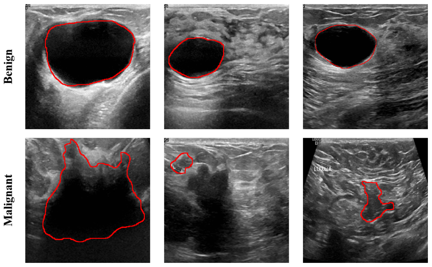
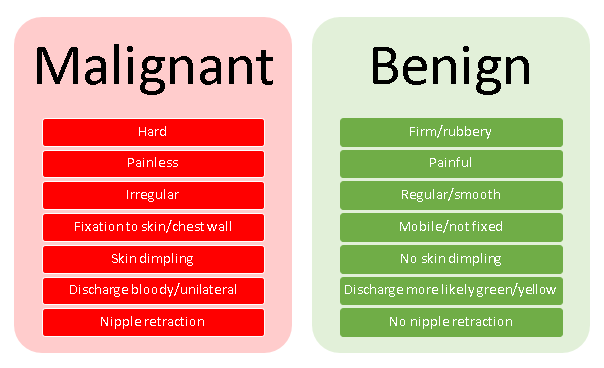
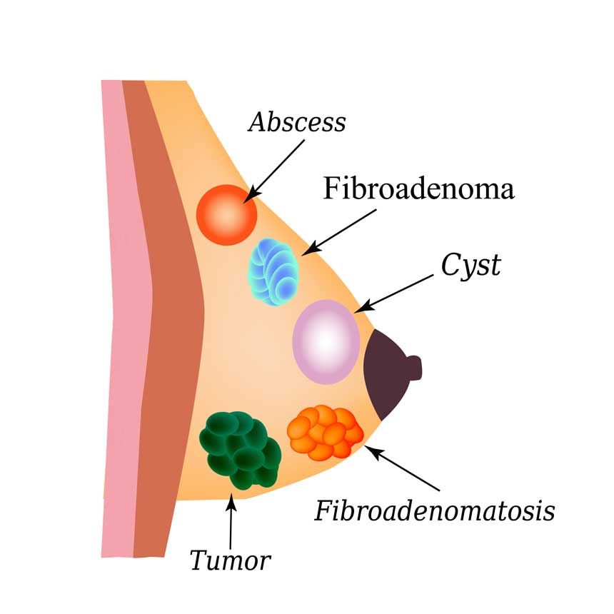
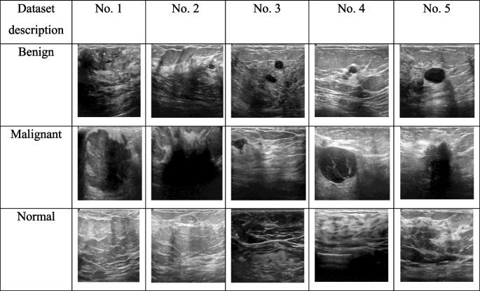
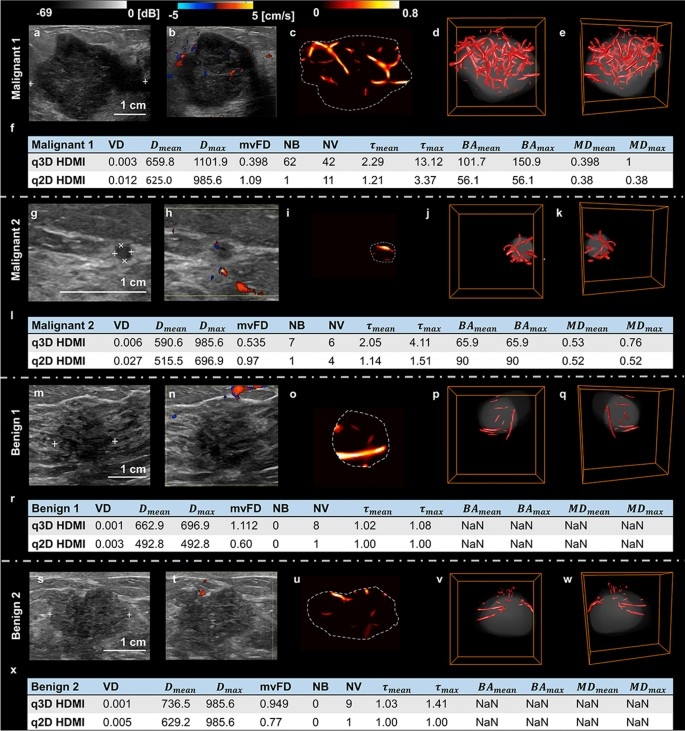

# 🧬 Benign vs Malignant Findings

## 📋 Summary
This note outlines the clinical differences between **benign** and **malignant** findings, specifically in breast and lung evaluations.

---

## ✅ Benign Findings

- **Growth Pattern:** Non-invasive, localized
- **Borders:** Well-defined, smooth margins
- **Growth Rate:** Slow-growing or stable over time
- **Symptoms:** Often asymptomatic
- **Histology:** Normal cellular architecture, no atypia
- **Examples:**
  - **Breast:** Fibroadenoma, cyst, fibrocystic changes
  - **Lung:** Granuloma, hamartoma, post-inflammatory scar

> 💡 **Impression (Example):**  
> *No suspicious mass, distortion, or abnormal calcifications. Findings consistent with benign etiology. Routine follow-up recommended.*

---

## ⚠️ Malignant Findings

- **Growth Pattern:** Invasive, potential to spread (metastasis)
- **Borders:** Irregular, spiculated or ill-defined
- **Growth Rate:** Rapid progression
- **Symptoms:** May include pain, weight loss, cough, bleeding
- **Histology:** Atypical cells, mitotic activity, abnormal nuclei
- **Examples:**
  - **Breast:** Invasive ductal carcinoma, lobular carcinoma
  - **Lung:** Adenocarcinoma, squamous cell carcinoma, small cell carcinoma

> 🚨 **Impression (Example):**  
> *Spiculated mass in the upper outer quadrant with associated lymphadenopathy. Findings suspicious for malignancy. Biopsy recommended.*
🩺 Breast Lump Classification: Benign vs Malignant

📘 Summary

This project explores the classification of breast tumors into benign (non-cancerous) and malignant (cancerous) types using machine learning models. The goal is to identify which algorithm best predicts tumor type based on various diagnostic features.

This project uses machine learning to classify breast tumors as **benign (non-cancerous)** or **malignant (cancerous)** based on medical diagnostic data.
---

This project:
- Explores the clinical difference between **benign** and **malignant** findings.
- Analyzes breast tumor data using Python.
- Builds and evaluates classification models.
- Selects the best-performing model based on accuracy and other metrics.

---

## 📊 Dataset Summary

- **Source:** Breast Cancer Wisconsin Diagnostic Dataset  
- **Total samples:** 569  
- **Features:** 30 (e.g., radius, texture, concavity)  
- **Target:** Diagnosis (`B` = Benign, `M` = Malignant)  
- **Null values:** Removed from unused column

---

## 🧪 Model Development

- Data was standardized using `StandardScaler`
- Data split with `train_test_split` (70% train / 30% test)
- Models tested:
  - `Logistic Regression`
  - `K-Nearest Neighbors (KNN)`
  - `Random Forest`
  - `Decision Tree`
- Cross-validation was used for performance comparison

---

## 🏆 Final Model: K-Nearest Neighbors

- **Train Accuracy:** 97%  
- **Test Accuracy:** 96%  
- **Precision:** 1.00  
- **Recall:** 0.91  
- **F1 Score:** 0.95  
- **ROC AUC Score:** 0.95  

🎯 **KNN provided the best overall accuracy and was saved as the final model.**\\

# 🧬 Benign vs Malignant Findings

## 📋 Clinical Overview

This section outlines the key clinical differences between **benign** and **malignant** findings, particularly in breast and lung evaluations. Understanding these distinctions is crucial for effective diagnosis, treatment planning, and patient communication.

---

### ✅ Benign Findings (Non-Cancerous)

- **Growth Pattern**: Localized and non-invasive  
- **Borders**: Well-defined, smooth margins  
- **Growth Rate**: Slow-growing or stable over time  
- **Symptoms**: Often asymptomatic  
- **Histology**: Normal cellular architecture with no cellular atypia  

**Examples**  
- **Breast**: Fibroadenoma, simple cysts, fibrocystic changes  
- **Lung**: Granuloma, hamartoma, post-inflammatory scarring  

💡 **Typical Impression**:  
“No suspicious mass, distortion, or abnormal calcifications. Findings consistent with benign etiology. Routine follow-up recommended.”

---

### ⚠️ Malignant Findings (Cancerous)

- **Growth Pattern**: Invasive, with potential for metastasis  
- **Borders**: Irregular, spiculated, or poorly defined  
- **Growth Rate**: Rapid and aggressive progression  
- **Symptoms**: May include pain, weight loss, persistent cough, or bleeding  
- **Histology**: Atypical cells, frequent mitoses, nuclear abnormalities  

**Examples**  
- **Breast**: Invasive ductal carcinoma, lobular carcinoma  
- **Lung**: Adenocarcinoma, squamous cell carcinoma, small cell carcinoma  

🚨 **Typical Impression**:  
“Spiculated mass in the upper outer quadrant with associated lymphadenopathy. Findings suspicious for malignancy. Biopsy recommended.”

---

## 📘 Project Summary

This project uses **machine learning** to classify breast tumors as **benign** or **malignant** based on diagnostic features such as shape, texture, and cellular properties.

### Key Objectives:
- Explore clinical patterns in breast tumor diagnostics  
- Analyze and preprocess medical data using Python  
- Build and evaluate classification models (e.g., KNN, Logistic Regression)  
- Identify the most accurate algorithm using performance metrics  

---

## 💼 Business Recommendations

This AI-powered breast lump classifier provides meaningful impact for both **healthcare professionals** and **business innovators**.

### 🏥 Clinical Use Cases

- **Early Detection Support**  
  Aids radiologists and oncologists by flagging high-risk tumors for prompt investigation.

- **Workflow Optimization**  
  Prioritizes malignant cases, reducing unnecessary biopsies and improving clinical efficiency.

- **Diagnostic Confidence**  
  Supports expert decision-making, especially in under-resourced or rural settings.

---

### 🧠 AI Health Startup Opportunities

- **Smart Screening Apps**  
  Integrate into mobile or web-based applications for public health education or telemedicine.

- **Electronic Medical Record (EMR) Integration**  
  Embed predictive features directly into EMR systems to streamline diagnostics.

- **Offline Deployment for Rural Health**  
  Deliver offline AI capabilities in low-infrastructure environments for underserved populations.

---

### 📈 Business Impact & ROI

- **Operational Efficiency**  
  Automates parts of the diagnostic process, saving time and cost.

- **Scalable & Cost-Effective**  
  Reduces overhead for hospitals, NGOs, and mobile clinics with low-cost, high-accuracy tools.

- **Market Differentiation**  
  Builds patient trust and enhances the value proposition of health-tech platforms.

---

> ⚠️ **Disclaimer**: This tool is intended for educational and research purposes only. It should not be used for official medical diagnosis without supervision by licensed medical professionals.

> Deployed with AWS Cloud Services

 Network URL: [http://3.231.93.0:8501]

