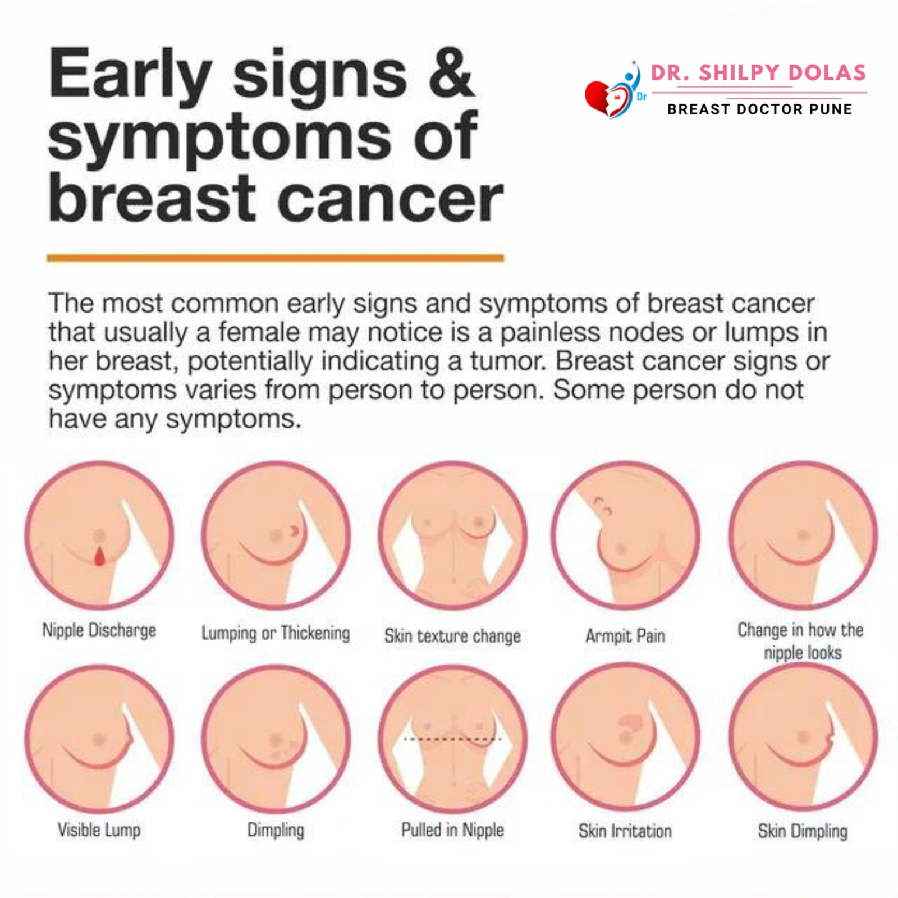

# 🧬 Benign vs Malignant Findings

## 📋 Summary
This note outlines the clinical differences between **benign** and **malignant** findings, specifically in breast and lung evaluations.

---

## ✅ Benign Findings

- **Growth Pattern:** Non-invasive, localized
- **Borders:** Well-defined, smooth margins
- **Growth Rate:** Slow-growing or stable over time
- **Symptoms:** Often asymptomatic
- **Histology:** Normal cellular architecture, no atypia
- **Examples:**
  - **Breast:** Fibroadenoma, cyst, fibrocystic changes
  - **Lung:** Granuloma, hamartoma, post-inflammatory scar

> 💡 **Impression (Example):**  
> *No suspicious mass, distortion, or abnormal calcifications. Findings consistent with benign etiology. Routine follow-up recommended.*

---

## ⚠️ Malignant Findings

- **Growth Pattern:** Invasive, potential to spread (metastasis)
- **Borders:** Irregular, spiculated or ill-defined
- **Growth Rate:** Rapid progression
- **Symptoms:** May include pain, weight loss, cough, bleeding
- **Histology:** Atypical cells, mitotic activity, abnormal nuclei
- **Examples:**
  - **Breast:** Invasive ductal carcinoma, lobular carcinoma
  - **Lung:** Adenocarcinoma, squamous cell carcinoma, small cell carcinoma

> 🚨 **Impression (Example):**  
> *Spiculated mass in the upper outer quadrant with associated lymphadenopathy. Findings suspicious for malignancy. Biopsy recommended.*
🩺 Breast Lump Classification: Benign vs Malignant

📘 Summary

This project explores the classification of breast tumors into benign (non-cancerous) and malignant (cancerous) types using machine learning models. The goal is to identify which algorithm best predicts tumor type based on various diagnostic features.





This project uses machine learning to classify breast tumors as **benign (non-cancerous)** or **malignant (cancerous)** based on medical diagnostic data.
---

This project:
- Explores the clinical difference between **benign** and **malignant** findings.
- Analyzes breast tumor data using Python.
- Builds and evaluates classification models.
- Selects the best-performing model based on accuracy and other metrics.


---

## 📊 Dataset Summary

- **Source:** Breast Cancer Wisconsin Diagnostic Dataset  
- **Total samples:** 569  
- **Features:** 30 (e.g., radius, texture, concavity)  
- **Target:** Diagnosis (`B` = Benign, `M` = Malignant)  
- **Null values:** Removed from unused column

---

## 🧪 Model Development

- Data was standardized using `StandardScaler`
- Data split with `train_test_split` (70% train / 30% test)
- Models tested:
  - `Logistic Regression`
  - `K-Nearest Neighbors (KNN)`
  - `Random Forest`
  - `Decision Tree`
- Cross-validation was used for performance comparison

---

## 🏆 Final Model: K-Nearest Neighbors

- **Train Accuracy:** 97%  
- **Test Accuracy:** 96%  
- **Precision:** 1.00  
- **Recall:** 0.91  
- **F1 Score:** 0.95  
- **ROC AUC Score:** 0.95  

🎯 **KNN provided the best overall accuracy and was saved as the final model.**

```python
# Save the model
import pickle
with open('breast_model.pkl', 'wb') as file:
    pickle.dump(knn, file)


link : http://localhost:8501/

